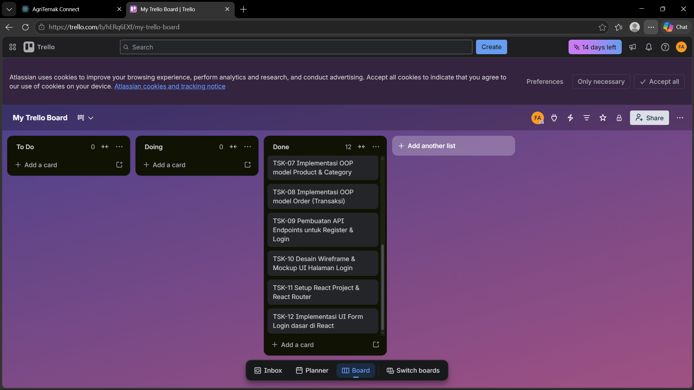

# DOKUMEN PERENCANAAN TEKNIS & SPRINT 1 STARTUP MINI
**Mata Kuliah:** Technopreneurship (TI242642)  
**Program Studi:** S1 Teknik Informatika - Universitas Sains dan Teknologi Indonesia  
**Tugas:** Tugas Mandiri Ke-8 (Setup Proyek & Perencanaan Sprint 1 Startup Mini)

---

## 1. Identitas Tim & Peran (Sprint 1)
* **Nama Tim:** AgriTernak Dev Team  
* **Daftar Anggota & Peran (Kelompok 2 Orang):**
  * **Fika Arieq Nur Rahmat** - *Product Owner, Scrum Master, & Lead Frontend Developer*
    * Mengoordinasi pembagian tugas tim, mengelola Trello board, menyusun target sprint, merancang struktur komponen React, routing halaman, serta mengintegrasikan API backend ke frontend.
  * **Fikri Meiza Putra** - *Lead Backend Developer & UI/UX Designer*
    * Bertanggung jawab atas desain database, pembuatan model data berbasis OOP, pengembangan API endpoints menggunakan Flask, serta merancang wireframe/mockup tampilan aplikasi.

---

## 2. Deskripsi Produk Teknologi
**AgriTernak Connect** adalah platform marketplace digital (startup mini) yang menghubungkan petani dan peternak lokal secara langsung dengan pembeli (B2C & B2B). Platform ini bertujuan memotong rantai distribusi pertanian dan peternakan tradisional yang panjang dan sering kali merugikan produsen kecil. Melalui AgriTernak Connect, petani/peternak dapat dengan mudah mengelola katalog produk hasil panen atau ternak, menetapkan harga yang adil, serta memantau stok secara real-time. Di sisi lain, pembeli mendapatkan akses langsung ke bahan pangan segar berkualitas dengan harga kompetitif dan sistem pelacakan pesanan yang transparan. Dengan menyederhanakan rantai pasok melalui teknologi RESTful API berbasis Flask dan antarmuka React yang responsif, platform ini mempercepat transaksi, mengurangi limbah pangan akibat penyimpanan terlalu lama, serta mendorong kesejahteraan ekonomi komunitas pertanian lokal secara berkelanjutan.

---

## 3. Arsitektur Sederhana (Diagram Blok)
Aplikasi menggunakan arsitektur **Client-Server (Three-Tier Architecture)**:
1. **Presentation Layer (Frontend)**: React.js SPA (Single Page Application) yang berjalan di sisi browser klien.
2. **Application Layer (Backend)**: Flask RESTful API yang melayani request dari klien dan menerapkan logika bisnis (business logic).
3. **Database Layer (Data Store)**: Relational Database MySQL untuk menyimpan data user, produk, kategori, dan pesanan secara persisten.

Berikut adalah diagram blok arsitektur interaksinya:

```mermaid
graph TD
    subgraph Client [Client - Frontend]
        A["React.js SPA\n(Port 3000)"]
    end

    subgraph Server [Application - Backend]
        B["Flask Web Server\n(Port 5000)"]
        C["JWT Authentication\n(Security)"]
        D["SQLAlchemy ORM\n(Data Mapper)"]
    end

    subgraph Database [Data Store]
        E[("MySQL Database\n(agriternak_db)")]
    end

    A <-->|HTTP Requests / JSON Responses\n(CORS Enabled)| B
    B <--> C
    B <--> D
    D <-->|SQL Queries| E
```

---

## 4. Penerapan Object-Oriented Programming (OOP)
Proyek ini diimplementasikan menggunakan prinsip OOP dalam pemodelan data backend (menggunakan SQLAlchemy ORM). Tiga kelas utama yang digunakan adalah:

### A. Konsep OOP yang Diterapkan
1. **Inheritance (Pewarisan)**: Kelas `User`, `Product`, dan `Order` mewarisi properti dan metode dari kelas dasar ORM `db.Model` untuk pemetaan database otomatis.
2. **Encapsulation (Pengkapsulan)**: 
   - Atribut sensitif seperti password pada `User` dienkapsulasi dengan variabel privat (`__password`) dan hanya dapat diakses/diubah melalui metode `setPassword()` dan `checkPassword()`.
   - Atribut `harga` dan `stok` pada `Product` serta `total` pada `Order` dienkapsulasi dengan metode getter/modifier khusus (`getHarga()`, `getStok()`, `updateStok()`, `getTotal()`).

### B. Detail Struktur Kelas (Classes, Attributes & Methods)

| Nama Kelas | Atribut (Attributes) | Metode (Methods) | Hubungan/Relasi |
| :--- | :--- | :--- | :--- |
| **User** | - `id` (Integer, PK)<br>- `nama` (String)<br>- `email` (String, Unique)<br>- `__password` (String, Private)<br>- `role` (Enum)<br>- `no_hp` (String)<br>- `created_at` (DateTime) | - `setPassword(password)`: Enkripsi password<br>- `checkPassword(password)`: Validasi password login<br>- `getProfil()`: Mengembalikan info profil user dalam format dict | - Satu `User` memiliki satu detail `Petani`<br>- Satu `User` (role pembeli) dapat memiliki banyak `Order` |
| **Product** | - `id` (Integer, PK)<br>- `petani_id` (Integer, FK)<br>- `category_id` (Integer, FK)<br>- `nama` (String)<br>- `__harga` (Numeric, Private)<br>- `__stok` (Integer, Private)<br>- `satuan` (String)<br>- `status` (Enum)<br>- `created_at` (DateTime) | - `getHarga()`: Mengambil harga desimal<br>- `getStok()`: Mengambil sisa stok produk<br>- `updateStok(jumlah_baru)`: Memperbarui stok dan status produk<br>- `updateHarga(harga_baru)`: Memperbarui harga produk<br>- `hapusProduk()`: Nonaktifkan status produk<br>- `toDict()`: Serialisasi objek ke dictionary | - Dimiliki oleh satu `Petani` (`petani_id`) <br>- Tergolong dalam satu `Category` (`category_id`)<br>- Dapat dipesan di banyak `Order` |
| **Order** | - `id` (Integer, PK)<br>- `pembeli_id` (Integer, FK)<br>- `product_id` (Integer, FK)<br>- `jumlah` (Integer)<br>- `__total` (Numeric, Private)<br>- `status` (Enum)<br>- `catatan` (Text)<br>- `order_date` (DateTime) | - `getTotal()`: Mengambil total harga transaksi<br>- `hitungTotal(harga_satuan)`: Menghitung ulang total belanja<br>- `konfirmasi() / kirim() / selesai() / batalkan()`: Mengubah status transaksi<br>- `toDict()`: Serialisasi objek ke dictionary | - Dipesan oleh satu `User` (pembeli)<br>- Memesan satu `Product` |

---

## 5. Target MVP (Minimum Viable Product) Minggu Ke-14
Fitur minimal yang harus berjalan 100% pada demonstrasi akhir di Minggu ke-14:
1. **Autentikasi Pengguna (Login & Register)**:
   - Pengguna baru dapat mendaftarkan akun sesuai dengan role (Petani/Peternak vs Pembeli).
   - Pengguna terdaftar dapat masuk (Login) dan mendapatkan JWT Token untuk akses API berproteksi.
2. **Katalog Produk (Sisi Petani/Peternak & Pembeli)**:
   - Petani/peternak dapat mengunggah (posting) produk hasil tani atau ternaknya, mengupdate stok, dan merubah harga.
   - Pembeli dapat menelusuri daftar produk yang tersedia berdasarkan kategori (hasil tani / hasil ternak).
3. **Sistem Keranjang & Transaksi Pemesanan**:
   - Pembeli dapat melakukan pemesanan produk.
   - Sistem melakukan pengecekan stok, mengurangi stok secara otomatis apabila pesanan berhasil dibuat, dan menjumlahkan total harga belanja.
   - Petani/peternak dapat mengonfirmasi atau memproses status pesanan dari pembeli.

---

## 6. Daftar Tugas (Task) & Distribusi Sprint 1 (Minggu 9-10)
Berikut adalah visualisasi daftar minimal 10 tugas realistis yang dimasukkan ke dalam **Trello Board** untuk Sprint 1:

| ID | Nama Task | Assignee (Peran) | Label | Estimasi | Status | Deskripsi |
| :--- | :--- | :--- | :--- | :---: | :--- | :--- |
| **TSK-01** | Inisialisasi GitHub & Setup Git di root folder | Lead Backend | Infra | 1 jam | **Done** | Menginisialisasi Git di folder root agriternakconnect/ dan menghapus repo nested di frontend/ |
| **TSK-02** | Membuat file .gitignore dan README.md | Product Owner | Dokumentasi | 1 jam | **Done** | Menambahkan berkas abaian git (.gitignore) dan petunjuk cara instalasi di README.md |
| **TSK-03** | Inisialisasi Trello Board & Sprint Planning | Product Owner | Manajemen | 1 jam | **Done** | Membuat Board Trello, mendefinisikan kolom status dan mendistribusikan task Sprint 1 |
| **TSK-04** | Membuat dokumen perencanaan teknis Tugas 8 | Semua Anggota | Dokumentasi | 2 jam | **Done** | Menyusun dokumen perencanaan arsitektur, diagram OOP, dan target MVP (format markdown/PDF) |
| **TSK-05** | Konfigurasi database MySQL & Flask-SQLAlchemy | Lead Backend | Backend | 3 jam | **To Do** | Menyiapkan schema database `agriternak_db` dan konfigurasi koneksi di file `config/database.py` |
| **TSK-06** | Implementasi OOP model User dan Petani | Lead Backend | Backend | 3 jam | **Done** | Menulis class `User` dan `Petani` dengan enkapsulasi password dan relasi database di Flask |
| **TSK-07** | Implementasi OOP model Product & Category | Lead Backend | Backend | 3 jam | **Done** | Menulis class `Product` dan `Category` lengkap dengan metode getter/setter untuk stok dan harga |
| **TSK-08** | Implementasi OOP model Order (Transaksi) | Lead Backend | Backend | 4 jam | **Done** | Menulis class `Order` lengkap dengan logika kalkulasi harga total belanja pembeli |
| **TSK-09** | Pembuatan API Endpoints untuk Register & Login | Lead Backend | Backend | 4 jam | **Done** | Membuat router `/api/auth/register` dan `/api/auth/login` menggunakan Flask Blueprint & JWT |
| **TSK-10** | Desain Wireframe & Mockup UI Halaman Login | UI/UX Designer | Desain | 3 jam | **To Do** | Membuat mockup tampilan interface form registrasi dan login menggunakan Figma |
| **TSK-11** | Setup React Project & React Router | Lead Frontend | Frontend | 4 jam | **To Do** | Menyiapkan dependensi react-router-dom dan membuat routing dasar untuk halaman login/register |
| **TSK-12** | Implementasi UI Form Login dasar di React | Lead Frontend | Frontend | 3 jam | **To Do** | Membuat komponen form login menggunakan React state untuk menampung input pengguna |

---

## 7. Lampiran Tangkapan Layar Trello Board
Berikut adalah bukti visual dari Trello Board kelompok kami yang memuat status pembagian tugas, kategori label, estimasi waktu, serta penanggung jawab masing-masing *task*:



*Catatan: Harap simpan file gambar screenshot Trello Anda dengan nama `trello_screenshot.png` di dalam folder `docs/` agar gambar di atas otomatis terhubung ketika dokumen ini dicetak menjadi PDF.*
